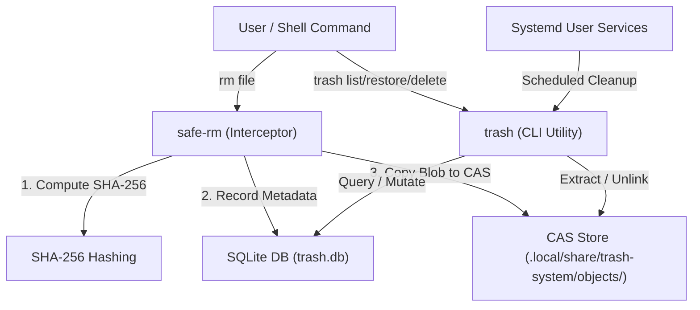

# 🌌 Arch Linux Configurations & Custom CAS-Trash System

<div align="center">


A premium, highly-automated dotfiles repository for Arch Linux, featuring a custom **Hyprland Wayland Compositor** desktop, automated hardware and profile-based configuration engines, and a custom **Content-Addressable Storage (CAS) Trash Management System**.

[Overview](#-overview) • [Architecture](#%EF%B8%8F-repository-architecture) • [Components](#-system-components) • [Trash System](#-cas-trash-management-system) • [Installation](#-installation-guide) • [Troubleshooting](#-troubleshooting)

</div>

---

## 🔍 Overview

This repository contains curated, modern dotfiles engineered for performance, minimalism, and aesthetic excellence. It transitions away from standard static dotfiles in favor of an **active, environment-aware configuration suite** that dynamically adapts to hardware (GPUs, Virtual Machines vs. Bare-Metal) and organizes software deployment via clean profiles.

---

## 🛠️ Repository Architecture

Our dotfiles utilize an intelligent, profile-based provisioning system. Rather than linking files blindly, a modular shell runner detects hardware, reconciles package lists, and applies links cleanly.

```
.
├── fish/                       # Fish shell configs & environment wrappers
├── hypr/                       # Hyprland, Hypridle, and Hyprlock suites
├── lid-sounds/                 # Hardware state listening hook scripts
├── nvim/                       # Extensible Lua-based Neovim development environment
├── packages/                   # Declarative package lists (pacman/aur) divided by profile
│   ├── pacman/
│   └── aur/
├── scripts/                    # Orchestration engines
│   ├── core/
│   │   ├── detect.sh           # Hardware and virtualization sensing
│   │   ├── reconcile.sh        # Profile manifest compiler
│   │   └── apply.sh            # Dynamic Stow-based link applicator
│   └── bootstrap-tools.sh      # Python virtual environment orchestrator
├── starship/                   # Starship shell prompt configuration
├── system/                     # Repository declarations
│   └── manifest.yaml           # Active deployment profile definitions
├── trash/                      # Content-Addressable Storage (CAS) Trash System
├── waybar/                     # Rich modern status bar with system monitors
├── wofi/                       # Smooth glassmorphic application launcher
└── zathura/                    # Keyboard-optimized document viewer
```

### ⚙️ Automation Engines

*   **`scripts/core/detect.sh` (Hardware Sensing):** Automatically inspects `lspci` to recognize GPU drivers (`nvidia`, `amd`, `intel`) and queries `systemd-detect-virt` to distinguish between VM guest instances and physical `baremetal` installations, saving state parameters to a JSON object.
*   **`scripts/core/reconcile.sh` (Profile Solver):** Reads [system/manifest.yaml](file:///home/aditya/dotfiles/system/manifest.yaml), extracts targeted profiles (such as `base` and `hyprland`), matches corresponding `.txt` package sheets, merges duplicate packages, and writes resolved files.
*   **`scripts/core/apply.sh` (Link Orchestrator):** Solves system symlinks dynamically using GNU Stow, safely ignoring system files like `state/`, `logs/`, or `.git/`, ensuring custom configurations reside correctly inside `$HOME`.

---

## 🖥️ System Components

### 🪟 Hyprland & Desktop Experience
*   **Hyprland:** A smooth, highly responsive, dynamic tiling Wayland compositor configured with physics-based animations, custom window rules, and a focus-centric workspace layout.
*   **Hyprlock & Hypridle:** Integrated screen locking and power-saving daemons that react immediately to session idle notifications, keeping power consumption minimal.
*   **Waybar:** A top-screen glassmorphic status bar displaying current workspace indicators, resources (CPU, Memory, Disk), dynamic audio volume level, time-date displays, and bluetooth adapter properties via custom background scripts ([waybar/.config/waybar/bluetooth.sh](file:///home/aditya/dotfiles/waybar/.config/waybar/bluetooth.sh)).
*   **Wofi Launcher:** A high-speed application launcher custom-styled with subtle hover highlights, blurred backdrops, and modern list selections.

### 🐚 Terminal & Editors
*   **Fish Shell:** Modern, interactive shell equipped with live syntax highlighting, autosuggestions based on command history, and custom functional wrappers.
*   **Starship Prompt:** Fast, sleek cross-shell terminal prompt configured with dynamic Git status tags, runtime environment symbols, and execution timers.
*   **Neovim:** A personalized development setup loading modular packages via `lazy.nvim`. Features Language Server Protocol (LSP) auto-configuration, tree-sitter syntax styling, and quick fuzzy search parameters.
*   **Zathura:** A minimalist, keyboard-centric document viewer optimized for rapid PDF browsing. Integrates with a unique Fish shell alias `open` which maps documents directly to Zathura.

### 🔊 Lid-Sound and Hook Triggers
A custom background listener maps physical system triggers:
*   **Lid Closed:** Locks the active session safely utilizing `hyprlock`.
*   **Lid Opened:** Authenticates, plays an initialization audio sound effect (`open.wav`) utilizing `mpv` backgrounds, and wakes displays dynamically.

### 🗃️ Office & PDF Utilities
Bundled under `.local/bin` are custom standalone scripts backed by modular Python virtual environments managed inside `.local/share/`:
*   `docx2pdf`: Rapid command-line `.docx` to PDF document formatting.
*   `pdf2docx`: Precise layout-preserving PDF to Microsoft Word converter.
*   `pdfmerge`: High-fidelity PDF report compilation utility.

---

## 🗑️ CAS Trash Management System

The repository features an enterprise-grade, custom **Content-Addressable Storage (CAS)-based Trash System**. Rather than relying on simple, standard file unlinking or standard directories which lead to filename collisions, this system tracks files logically via a SQLite relational catalog and deduplicates physical files in a hashed directory structure.

### 📐 System Architecture & Flow



### 📂 Storage Directory Structure
All deleted objects and SQLite databases reside safely within the user's directory:
```
~/.local/share/trash-system/
├── db/
│   ├── trash.db            # SQLite relational database (WAL mode)
│   └── trash.db.lock       # Multi-process concurrency lock
└── objects/
    └── <hash-prefix>/<hash> # De-duplicated file blobs (Content Addressable)
```

> [!NOTE]
> **Object Paths:** Blobs are stored utilizing the standard Git directory indexing algorithm:
> `~/.local/share/trash-system/objects/${hash:0:2}/${hash:2:2}/${hash}`
> This prevents single-directory folder indexing limits on standard Unix filesystems.

---

### 💾 Relational Data Model

#### 1. Main Directory Catalog (`trash`)
```sql
CREATE TABLE trash (
    id TEXT PRIMARY KEY,            -- Unique UUID identifying the deleted item
    original_path TEXT,            -- Full absolute path prior to deletion
    filename TEXT,                  -- Base name of the file
    extension TEXT,                 -- File extension parsed
    deletion_time INTEGER,          -- Epoch Unix timestamp of deletion
    mime_type TEXT,                 -- Evaluated MIME signature
    category TEXT,                  -- Category flags
    origin_root TEXT,               -- Starting partition mount path
    project_root TEXT,              -- Target git project root (if applicable)
    storage_path TEXT,              -- Path descriptor
    size INTEGER,                   -- Total file size in bytes
    hash TEXT,                      -- SHA-256 hash string for CAS mapping
    is_restored INTEGER DEFAULT 0,  -- Recovery indicator flag
    active_days INTEGER DEFAULT 0,  -- Age counter
    pinned INTEGER DEFAULT 0        -- Exemption status for automatic GC runs
);
```

#### 2. Version Schema Tracker (`meta`)
```sql
CREATE TABLE meta (
    key TEXT PRIMARY KEY,
    value TEXT
);
```

#### 3. Active Hash Index
```sql
CREATE INDEX idx_hash_active ON trash(hash) WHERE is_restored = 0;
```

---

### 🕹️ Command Interface

#### 🟩 Interceptor: `safe-rm`
Replaces standard destructive `rm` commands for files. It performs transaction-safe operations:
1.  Computes target file SHA-256 checksums.
2.  Pre-stages the payload file into secure system temporary space.
3.  Ensures database entries are saved correctly under SQLite WAL transactions.
4.  Relocates files to deduplicated CAS paths. If the content hash already exists, the storage path is reused immediately, saving disk space.
5.  Triggers safe atomic rollbacks on any environment, lock, or write exceptions.

#### 🎛️ Controller: `trash`
Provides powerful system commands to interact with the repository:

| Command | Action | Flow / Properties |
| :--- | :--- | :--- |
| `trash list` | Displays catalog | Formats logical paths, extensions, sizes, dates, and pin markers. |
| `trash restore <id>` | Restores file | Fetches metadata, pulls CAS target block, validates checksums, and restores it. |
| `trash delete <id>` | Purges item | Cleans database entry and unlinks target CAS block. Supports lists/ranges (`1-5`). |
| `trash clear` | Purges catalog | Performs standard truncation on active DB entries and purges all CAS objects. |
| `trash pin <id>` | Pins item | Marks record as `pinned=1`, exempting it from automatic timers and cleanups. |
| `trash unpin <id>`| Unpins item | Re-enables standard lifespan age limits and general cleanups. |
| `trash cleanup <N>`| Prunes aging | Deletes non-pinned files exceeding `N` storage days. |
| `trash scan` | GC sweeping | Scans object folder and purges orphan blobs unreferenced in `trash.db`. |
| `trash health` | Audit check | Performs SQLite diagnostic checks (`PRAGMA integrity_check`). |

---

### 🛡️ Concurrency & Safety Guarantees

*   **Transactional Durability:** SQLite databases operate inside **Write-Ahead Logging (WAL)** mode coupled with `synchronous = FULL` to resist filesystem corruptions, lockups, and power failures.
*   **Writer Protection:** All operations verify locks utilizing system `flock` boundaries to ensure parallel tasks execute sequentially:
    ```bash
    exec 200>"$LOCK_FILE"
    flock -n 200 || exit 1
    ```
*   **Exclusion Guards:** The interceptor refuses to wipe system critical paths (e.g. `/`, `/usr`, `/var`), skips system directories safely, and protects pinned records from purge scripts.
*   **Systemd Automation:** Three user timers run in the background:
    1.  `trash-age.timer`: Evaluates, increments daily storage ages, and applies notifications.
    2.  `trash-clean.timer`: Automates cleanup of non-pinned, aging files safely.
    3.  `trash-notify.timer`: Alerts user when trash sizes exceed safety parameters.

---

## 🚀 Installation Guide

### 📋 Prerequisites

Ensure you have a freshly installed Arch Linux machine with base tools.
```bash
sudo pacman -S --needed git base-devel stow
```

---

### 📥 1. Automated Setup (Recommended)

Our main script automates hardware checks, installs all dependencies, configures repositories, and hooks system variables seamlessly.

```bash
# Clone the repository to your home folder
git clone https://github.com/AdityaAgrawal08/My-Arch-Linux-Configurations.git ~/dotfiles
cd ~/dotfiles

# Launch the orchestrator
./install.sh
```

#### 🛡️ What `install.sh` performs behind the scenes:
1.  Downloads core utility packages (e.g., Stow, Pacman wrappers).
2.  Runs environment sensing (`detect.sh`) to log custom variables.
3.  Invokes profile compiler (`reconcile.sh`) using the custom manifests.
4.  Installs all Pacman dependencies and provisions `paru` as the AUR helper.
5.  Applies GNU Stow links to set up directories dynamically.
6.  Enables audio support (`pipewire`, `wireplumber`) and initializes systemd trash timers.
7.  Deploys Neovim Lua folders and configures the default shell to Fish.

---

### 📦 2. Manual Custom Stow Setup (Alternative)

If you prefer to configure your environment selectively, you can install GNU Stow and symlink packages manually:

```bash
sudo pacman -S stow

cd ~/dotfiles
# Individual component stowing
stow hypr
stow waybar
stow fish
stow nvim
stow starship
stow wofi
stow zathura
stow trash
```

---

## ⚡ Customization

To tailor components to your personal preferences, modify the following directories:

*   **Hyprland Rules:** Modify [hypr/.config/hypr/hyprland.conf](file:///home/aditya/dotfiles/hypr/.config/hypr/hyprland.conf) for hotkeys and layout options.
*   **Waybar Styling:** Edit [waybar/.config/waybar/config.jsonc](file:///home/aditya/dotfiles/waybar/.config/waybar/config.jsonc) and [style.css](file:///home/aditya/dotfiles/waybar/.config/waybar/style.css).
*   **Fish Shortcuts:** Customize [fish/.config/fish/config.fish](file:///home/aditya/dotfiles/fish/.config/fish/config.fish) to append custom variables and aliases.
*   **Terminal Prompt:** Modify [starship/.config/starship.toml](file:///home/aditya/dotfiles/starship/.config/starship.toml).

---

## 🔍 Troubleshooting

### 🖼️ Hyprland Core Start-Up Issues
*   Check if correct graphics drivers are installed for your detected GPU type (inspect `state/env.json`).
*   Check instance log files for exceptions:
    ```bash
    cat /tmp/hypr/$HYPRLAND_INSTANCE_SIGNATURE/hyprland.log
    ```

### 🔊 Trash System Locks & Restores
*   If a process hangs, check active filesystem locks:
    ```bash
    ls -l ~/.local/share/trash-system/db/trash.db.lock
    ```
*   If object verification failures occur, run a complete diagnostic sweep:
    ```bash
    trash health
    trash scan
    ```

### 🔡 Missing Nerd Fonts or Broken Symbols
*   Verify your font cache is up to date:
    ```bash
    sudo pacman -S ttf-jetbrains-mono-nerd ttf-nerd-fonts-symbols-common
    fc-cache -fv
    ```
